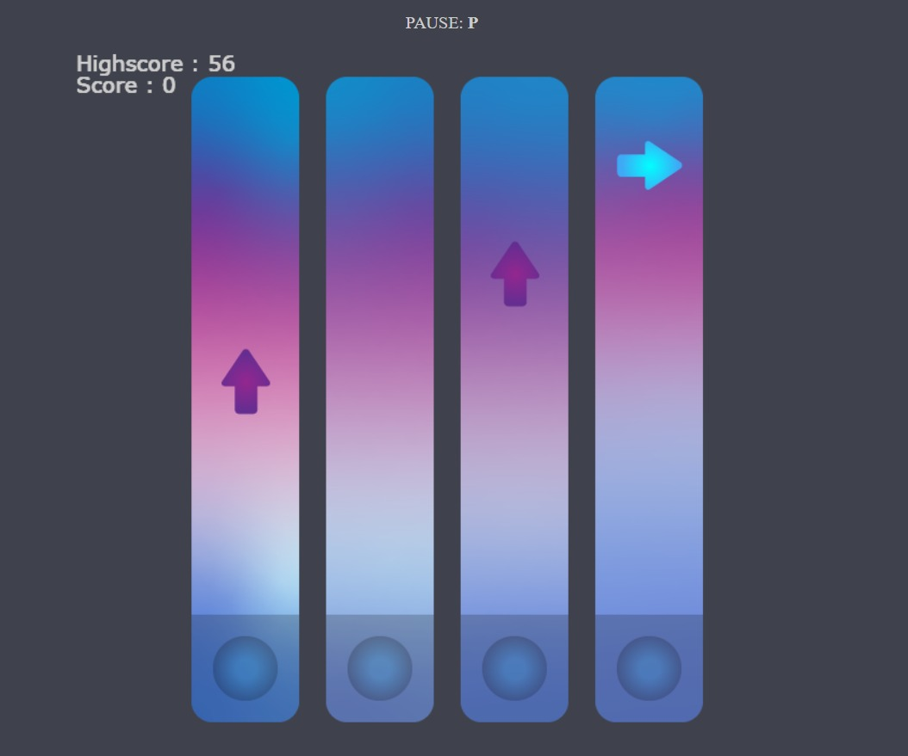
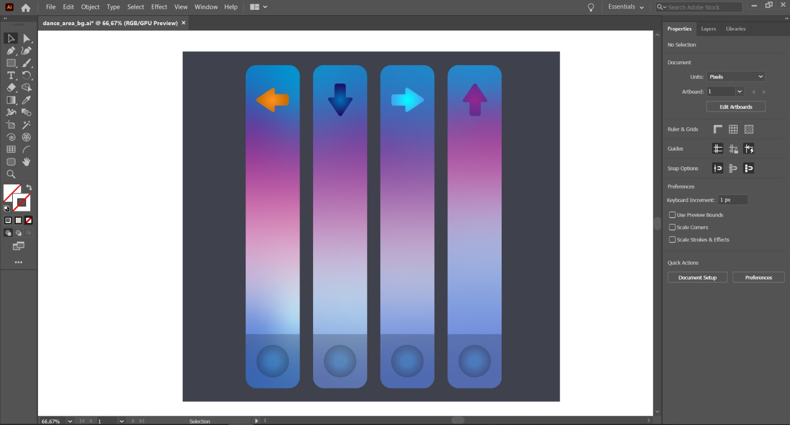

#Melodi 🎹
[Oyun Linki](https://tanersolak.github.io/Melodi-JS-Game/)

# Özet
Bursa Teknik Üniversitesi Web Tabanlı Programlama Dilleri quiz ödevi için istenen
## Hikaye

## Nasıl Oynanır?
`W` `A` `S` `D` tuşlarıyla veya yön tuşlarını kullanarak yukarıdan düşen oklarla aynı yön tuşuna tam zamanında basman gerek.
`P` tuşuna basarak oyunu duraklatabilirsin.

#Oyun İçi Görüntü

# Kullanılan Teknolojiler
- HTML
- JavaScript

## Oyun linki
https://tanersolak.github.io/Melodi-JS-Game/

# Tasarım
Oyun içinde yer alan objeler ve arka plan resmini Adobe Illustrator 2020 uygulamasında kendim çizdim.

#Müzik
Arka plan müziğine youtube üzerinden beğendiğim bir şarkıyı koydum.
(Müzik linki-> https://www.youtube.com/watch?v=V-ZVhAlxkgg)

#İletişim
[Linkedin](https://www.linkedin.com/in/taner-solak-aa30b91b4/)
